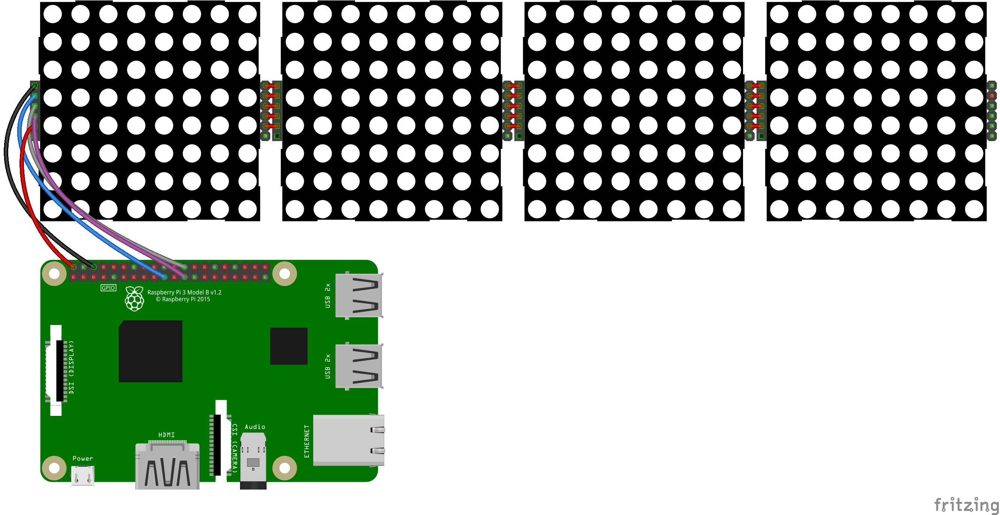

# spectrumLED


*spectrumLED* is a simple spectrum analyzer meant to be used with a 32x8 LED matrix (MAX7219). Though it can be easily modified to fit the other sizes and matrices.

## Build setup

* Hardware:
	* Orange Pi PC (or Raspberry PI)
	* PCM5102 DAC (or any other soundcard)

* Software:
	* Armbian (or Raspbian)
	* Python 3 and third-party packages:
		* [numpy](http://www.numpy.org)
		* [scipy](https://www.scipy.org)
		* [luma.core](https://github.com/rm-hull/luma.core)
		* [luma.led_matrix](https://github.com/rm-hull/luma.led_matrix)
		* [pyaudio](https://people.csail.mit.edu/hubert/pyaudio/)
	* ALSA

## Wiring

1. LED matrix:



|LED pin | OPi pin (phys) | OPi pin name|
|---     |---             |---          |
|VCC     | pin 4          | +5V         |
|GND     | pin 25         | GND         |
|DIN     | pin 19         | SPI0_MOSI   |
|CS      | pin 24         | SPI0_CS0    |
|CLK     | pin 23         | SPI0_CLK    |

2. PCM5102 DAC (optional):

|DAC pin|OPi pin (phys)|OPi pin name|
|---    | ---          | ---        |
|BCK    | pin 27       | PCM0_CLK   |
|DATA   | pin 37       | PCM0_DOUT  |
|LRCK   | pin 28       | PCM0_SYNC  |
|GND    | pin 34       | GND        |
|GND    | pin 39       | GND        |
|VCC    | pin 2        | +5V        |

## Configuration

1. Load a loopback kernel module with:
```bash
# modprobe snd-aloop
```

2. Configure ALSA to output multiple streams with `multi` plugin. Example configuration is listed in `asound.conf` file: `hw:1,0` is a normal soundcard, `hw:3,0` is a loopback output, `hw:3,1` is a loopback input. Just copy it with:

```bash
# cp asound.conf /etc/
```

Change these settings if needed: run `aplay -l` to list all devices and correct card and device indices in the configuration file.

3. Enable SPI and PCM devices in [FEX](http://linux-sunxi.org/Fex_Guide) (legacy kernel) file or [add certain overlays](https://docs.armbian.com/Hardware_Allwinner_overlays/) (mainline). This is an optional step and depends on your hardware setup. See Armbian site for details.

4. Configure an audio player. If you are using cmus, refer to `cmus.rc` file. I had no sound when `default` was specified in `dsp.alsa.device` option. Though `out` wrapper works fine.

5. Play some music and run the script:

```bash
$ python3 spectrumLED.py
```

## Real-world examples

Beto Sanchez: [1](https://twitter.com/betojsp/status/1072117207092682753) and [2](https://twitter.com/betojsp/status/1069261269474181122)
